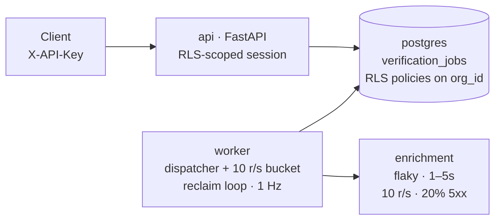

# Multi-Tenant Verification API — Design

_Ken Lee_

> The interesting requirements in this brief are **tenant isolation**,
> **fairness across orgs**, **a global 10 req/s ceiling on a downstream
> provider**, and **surviving a worker crash mid-job**. The CRUD surface is
> small. I designed against those four, and the implementation focuses on
> demonstrating each of them concretely.

## Contents

1. [Constraints I'm designing against](#1-constraints-im-designing-against)
2. [Architecture](#2-architecture)
3. [Tenant isolation (Postgres RLS)](#3-tenant-isolation-postgres-rls)
4. [Fairness: longest-waited org wins](#4-fairness-longest-waited-org-wins)
5. [Rate limiting via token bucket](#5-rate-limiting-via-token-bucket)
6. [Retries & backoff](#6-retries--backoff)
7. [Crash recovery](#7-crash-recovery)
8. [Data model](#8-data-model)
9. [API surface](#9-api-surface)
10. [Full production design (bells & whistles)](#10-full-production-design-bells--whistles)
11. [Vertical slice: implemented vs cut](#11-vertical-slice-implemented-vs-cut)

---

## 1. Constraints I'm designing against

- **Two orgs must never see each other's data.** Stronger than "always pass
  `org_id` in queries" — that's convention. I want it enforced at the
  database boundary.
- **10 req/s global ceiling on the downstream provider.** Not per-org, not
  per-worker. This shapes the dispatcher.
- **One noisy org cannot starve everyone else.** 10,000 jobs from Org A
  should not block Org B's single job.
- **Results survive a worker crash mid-job.** "In-progress" cannot be a
  state that requires the worker to recover it.
- **Transient 5xx from the provider (~20%) is normal.** Retries with
  backoff, capped.
- **Low absolute throughput.** 10 req/s is ~864k jobs/day at the ceiling.
  This is not a system that needs Kafka, Kubernetes, or a fleet of workers
  — and pretending otherwise would be the wrong signal.

## 2. Architecture



Four services in `docker compose`:

- **`api`** — FastAPI. Three endpoints. Each request opens a transaction,
  sets `app.current_org_id`, and every query is automatically scoped by
  Postgres RLS.
- **`worker`** — A single Python process running two asyncio loops: the
  dispatcher (claims and fires jobs) and the reclaimer (rescues stuck rows).
  Uses a privileged DB role that bypasses RLS, because scheduling needs
  cross-org visibility.
- **`enrichment`** — A separate FastAPI service that simulates the third-
  party provider. Sleeps 1–5s, returns 5xx ~20% of the time, and _enforces_
  the 10 req/s ceiling itself (returns 429 if exceeded). I made enforcement
  real because that's what lets a reviewer verify we're respecting the
  limit rather than taking my word for it.
- **`postgres`** — Single instance, RLS-enabled, schema and seed data loaded
  from `init.sql` on boot.

## 3. Tenant isolation (Postgres RLS)

I'm using Postgres Row-Level Security as the primary isolation mechanism.
The query layer is the wrong place to enforce tenancy: every new query is a
chance to forget the `WHERE org_id = ?` clause, and unit tests can't prove
the absence of that bug. RLS pushes the guarantee down to the database,
where every `SELECT`/`UPDATE`/`DELETE` is filtered by policy regardless of
what the application code does.

The mechanism:

```sql
ALTER TABLE verification_jobs ENABLE ROW LEVEL SECURITY;

CREATE POLICY tenant_isolation ON verification_jobs
  USING (org_id = current_setting('app.current_org_id')::uuid);
```

Per request, the API does:

```sql
BEGIN;
SET LOCAL app.current_org_id = '<org_uuid_from_api_key>';
-- all queries in this transaction are now scoped
COMMIT;
```

**The auth bootstrap.** The API-key→org lookup can't itself be RLS-scoped,
because we don't know the org yet. I keep credentials in a separate
`api_keys` table, which is treated as an _auth table_, not a tenant data
table — it has no RLS. The lookup is by `key_hash`, which is itself the
credential: knowing the hash _is_ the authorization, so there's no cross-
tenant risk to enforce at the row level. The flow is linear: hash the
header → `SELECT org_id FROM api_keys WHERE key_hash = ?` →
`SET LOCAL app.current_org_id = <org_id>` → enter the handler with full
RLS scoping. No sentinel, no conditional policy. Separating credentials
from tenant data also makes key rotation, expiry, and scopes easy to add
later (one org → many keys).

**The worker exemption.** The dispatcher must see jobs across all orgs to
make fairness decisions. It connects as a separate Postgres role with
`BYPASSRLS` granted. The privilege boundary is enforced by the database,
not the application.

### Making it hard to misuse (defense in depth)

RLS only helps if you can't accidentally route around it. Four layers,
strongest to most operational:

1. **Two Postgres roles, two DSNs.** `app_api` (no `BYPASSRLS`, scoped
   grants) and `app_worker` (`BYPASSRLS`). Each container is started with
   only its own DSN injected as an env var — there's no in-codebase switch
   between them. Escalating from API code to worker privilege would require
   credentials the API container doesn't have.
2. **Fail-closed RLS policies.** The policy uses the two-arg form of
   `current_setting`, which returns `NULL` when the GUC is unset rather than
   raising:

   ```sql
   CREATE POLICY tenant_isolation ON verification_jobs
     USING (org_id = current_setting('app.current_org_id', true)::uuid);
   ```

   `org_id = NULL` evaluates to `NULL`, which is not true, so no rows match.
   Forgetting to `SET LOCAL` doesn't leak data — the query returns empty.
3. **Single sanctioned session factory.** Route handlers receive sessions
   only via a FastAPI dependency, `get_scoped_session(org_id)`, which always
   sets the GUC inside a transaction. The underlying SQLAlchemy engine is
   module-private. Anyone wanting a raw connection has to go out of their
   way, which surfaces in code review.
4. **A regression test.** Connect as `app_api` with no GUC set, run
   `SELECT * FROM verification_jobs`, assert zero rows. RLS failing closed
   is silent — without this test, a future refactor that forgets to set the
   GUC would be caught by a customer complaint, not by CI.

### Why not just discipline + a repository pattern?

It works, until it doesn't. A junior engineer adds an admin query that
forgets the scope, or a join introduces a row from an unscoped table, or a
raw SQL migration touches the wrong rows. Tenant-leak bugs are catastrophic
and impossible to retract. The cost of RLS is ~50 lines of policy SQL; the
benefit is that the guarantee is enforced at the layer that actually
controls the data.

## 4. Fairness: longest-waited org wins

The fairness rule: **the org whose pending jobs have waited the longest
gets the next dispatch slot.** Concretely, I track `last_served_at` on each
org (initially `NULL`), and the claim query selects the next job belonging
to the org with the smallest `last_served_at` that still has eligible
pending work.

```sql
WITH next_org AS (
  SELECT o.id
  FROM organizations o
  WHERE EXISTS (
    SELECT 1 FROM verification_jobs j
    WHERE j.org_id = o.id
      AND j.status = 'pending'
      AND j.next_attempt_at <= now()
  )
  ORDER BY o.last_served_at NULLS FIRST
  LIMIT 1
),
claimed AS (
  SELECT j.id
  FROM verification_jobs j, next_org
  WHERE j.org_id = next_org.id
    AND j.status = 'pending'
    AND j.next_attempt_at <= now()
  ORDER BY j.created_at
  FOR UPDATE SKIP LOCKED
  LIMIT 1
)
UPDATE verification_jobs
SET status = 'in_progress', claimed_at = now(), attempts = attempts + 1
WHERE id IN (SELECT id FROM claimed)
RETURNING *;
```

After a successful claim, the worker bumps
`organizations.last_served_at = now()` for that org. The org rotates to the
back of the line.

This is essentially round-robin across orgs with pending work, weighted by
recency of service. With one org pushing 10k jobs and another org with one
job, the second org's job is dispatched on the very next tick after the
first org's most recent dispatch — it doesn't queue behind the other 9,999.

**Why not weighted fair queueing (deficit round-robin)?** WFQ adds value
when orgs have different priorities or quotas. For "no one starves," simple
longest-waited-first is sufficient and explainable in one paragraph. WFQ
would be the next step if Tofu introduces per-org SLAs.

## 5. Rate limiting via token bucket

A single in-process token bucket controls dispatch: capacity 10, refill
rate 10/sec. The worker loop is:

```python
while True:
    job = claim_next_job()           # fairness query, see §4
    if job is None:
        await asyncio.sleep(0.2)     # idle backoff
        continue
    await bucket.acquire()           # blocks until a token is available
    asyncio.create_task(process(job))
```

One mechanism, one knob. The bucket handles steady-state pacing (sustained
10 r/s), absorbs short idle periods (up to 10 tokens of headroom), and
naturally smooths out clock jitter without needing a tick scheduler. Under
a 1000-job backlog, the worker fires the first 10 immediately (the bucket
is full from idle), then settles to exactly 10/sec — which is the ceiling,
not over it. No thundering herd.

The bucket itself is ~20 lines: a `tokens` counter, a `last_refill`
timestamp, and an `acquire()` that refills lazily and sleeps if the bucket
is empty. Asyncio-friendly, no shared-memory locking needed for single-
worker.

**Belt-and-suspenders enforcement.** The enrichment service enforces the
10 r/s ceiling on its end too. If the dispatcher ever exceeds it (clock
skew, a bug, a reclaim flood), the provider returns 429 and we back off.
The rate-limit guarantee doesn't rest on the dispatcher being bug-free.

For multi-worker (production), the bucket moves to Redis with an atomic
Lua refill+decrement script — same algorithm, same knobs, just shared
state. See [§10](#10-full-production-design-bells--whistles).

## 6. Retries & backoff

Each job has an `attempts` counter and a `next_attempt_at` timestamp. On
transient failure (5xx, 429, network error, timeout):

- Set `status = 'pending'` (back in the queue).
- Bump `attempts`.
- Set `next_attempt_at = now() + 2^(attempts-1) seconds`. So: 1s, 2s, 4s,
  8s, 16s.
- After 5 attempts, terminal `failed` state with the last error captured in
  `result`.

Non-retryable failures (4xx other than 429) skip retries and go directly to
`failed`. Backoff uses simple exponential without jitter for the demo;
production should add jitter to avoid thundering herd after a provider
outage (see [§10](#10-full-production-design-bells--whistles)).

The claim query naturally respects backoff by filtering
`next_attempt_at <= now()`, so retries don't need a separate scheduler.

## 7. Crash recovery

A second asyncio loop runs once per second in the worker process:

```sql
UPDATE verification_jobs
SET status = 'pending', claimed_at = NULL
WHERE status = 'in_progress'
  AND claimed_at < now() - interval '60 seconds';
```

Any job claimed more than 60s ago is presumed orphaned (provider takes ≤5s;
60s is comfortably outside any healthy path) and pushed back to pending.
The next dispatcher tick will pick it up. `attempts` is _not_ incremented
on reclaim — the original increment already happened at claim time, so a
reclaimed job has already "used" one of its attempts.

This is a visibility-timeout pattern, implemented in Postgres. No separate
broker, no lease renewals. The full design moves this to per-row leases
held by named workers — see [§10](#10-full-production-design-bells--whistles).

### Idempotency at the provider boundary

If the worker crashes _after_ the provider has done the work but _before_
we wrote the result, the reclaim will re-dispatch and the provider will do
the work again. In production, this is solved with an idempotency key per
attempt — the provider deduplicates. For the demo, I'm calling this out
and accepting at-least-once semantics. Stubbed, not solved.

## 8. Data model

| Table | Columns | Notes |
|---|---|---|
| `organizations` | `id (uuid pk)`, `name`, `last_served_at` | Tenant metadata. Seeded with two orgs at boot. `last_served_at` drives fairness. |
| `api_keys` | `id (uuid pk)`, `org_id (fk)`, `key_hash (unique)`, `label`, `created_at` | Auth table. No RLS — lookup is by `key_hash`, which _is_ the credential. One org → many keys (rotation, scopes, expiry slot in here later). |
| `verification_jobs` | `id (uuid pk)`, `org_id (fk)`, `subject_email`, `metadata jsonb`, `status`, `attempts`, `next_attempt_at`, `claimed_at`, `result jsonb`, `created_at`, `updated_at` | RLS-protected. `status ∈ {pending, in_progress, completed, failed}`. |

**Indexes:**

- `(org_id, id DESC)` for paginated listing.
- `(next_attempt_at)` partial index `WHERE status = 'pending'` — the
  dispatcher's hot path.
- `(claimed_at)` partial index `WHERE status = 'in_progress'` — for the
  reclaim loop.

## 9. API surface

| Method | Path | Behavior |
|---|---|---|
| `POST` | `/verifications` | Body `{ subject_email, metadata? }`. Inserts a pending job. Returns the full job row immediately. |
| `GET` | `/verifications/:id` | Returns the job. 404 if not found _or_ not owned by this org — we never leak existence. |
| `GET` | `/verifications` | Page-based: `?page=1&page_size=50`. Returns `{ items, page, page_size, total }`. RLS keeps each org in their own slice. |
| `DELETE` | `/verifications` | Demo-only convenience to wipe the calling org's jobs. RLS-scoped so it cannot affect another tenant. |
| `GET` | `/` | The live demo dashboard (HTML, same-origin so it can call the API directly). |

**Auth.** `X-API-Key` header. Missing or unknown → 401. Implemented as a
FastAPI dependency that opens the transaction, sets the RLS GUC, and yields
a scoped session to the route handler.

## 10. Full production design (bells & whistles)

If this were the real system, the additions over the vertical slice would
be:

| Concern | Production approach |
|---|---|
| Multi-worker dispatch | Multiple worker pods. Global rate limit becomes a Redis token bucket (atomic Lua script: decrement-if-positive). Fairness query is unchanged. Each worker takes ≤1 token per loop iteration, then claims one job. Workers identify themselves with a UUID and write `claimed_by` on the row. |
| Lease renewal | Long-running jobs renew their lease (`UPDATE … SET claimed_at = now() WHERE claimed_by = $me`) every N seconds. Reclaim threshold drops from 60s to ~3× renewal interval. Distinguishes "worker is dead" from "job is slow." |
| Idempotency | Per-attempt idempotency key sent to provider. Provider dedupes within a window. Eliminates duplicate-work risk under at-least-once delivery. |
| Dead-letter handling | Jobs that exhaust retries land in a DLQ view with one-click replay. On-call has a runbook for triaging. |
| Per-org quotas & submission rate limits | Back-pressure at `POST /verifications`: `429` when an org's pending queue exceeds its quota. Prevents one org from chewing the global ceiling for hours. |
| Webhooks / async callbacks | On terminal state, POST to a customer-configured URL with HMAC signature and retry-with-backoff. Customers stop polling. |
| Observability | Prometheus metrics (queue depth per org, dispatch rate, retry rate, p50/p95/p99 end-to-end). OTel traces from API → DB → worker → provider. Structured JSON logs with `org_id`, `job_id`, `attempt` on every event. |
| Provider abstraction | Wrap the provider call behind an interface. Multiple providers behind a strategy (cost, latency, fallback). Circuit breaker per provider. |
| API key lifecycle | Keys have an id, label, created_at, expires_at, revoked_at, scope. Rotation supported via overlapping validity. Audit log on every authenticated call. |
| Backoff jitter | Add full jitter to exponential backoff. Prevents synchronized retry storms after a provider outage. |
| Schema for `metadata` | Today it's freeform JSONB. In production, customers register a schema and we validate on submit. |

## 11. Vertical slice: implemented vs cut

The implementation focuses on the four mechanisms that make this problem
interesting. Everything else is stubbed honestly.

### Implemented

- ✅ Postgres RLS for tenant isolation, with credentials kept in a separate
  `api_keys` auth table so the lookup is unscoped and clean, and a
  privileged `app_worker` role with `BYPASSRLS` for the dispatcher.
- ✅ Defense-in-depth around RLS: two Postgres roles (`app_api` /
  `app_worker`) with different grants, fail-closed policies via two-arg
  `current_setting`, single sanctioned session factory, and a regression
  test that asserts zero rows leak without the GUC.
- ✅ Fairness scheduler: longest-waited-org-wins via
  `organizations.last_served_at`.
- ✅ In-process token bucket (capacity 10, refill 10/sec) controlling the
  dispatcher. Single mechanism handles steady-state pacing, idle headroom,
  and natural smoothing.
- ✅ Retries with exponential backoff (1, 2, 4, 8, 16s), max 5 attempts.
- ✅ Crash recovery via reclaim loop with 60s visibility timeout. Verified
  end-to-end by killing the worker mid-job and watching the reclaimer
  return the orphan on restart.
- ✅ All three endpoints (submit, get, list-paginated) with API key auth,
  plus a small `DELETE` for demo resets and a live HTML dashboard at `/`.
- ✅ A real separate `enrichment` service that enforces its own 10 r/s
  ceiling, so compliance is observable, not assumed.
- ✅ A `scripts/load.py` harness that submits skewed load (e.g. 30 jobs
  from Org A, 1 from Org B) and prints a per-org summary using
  `job.updated_at − job.created_at` so the fairness signal is honest.
- ✅ Four test files (eight tests total): isolation (cross-org read is
  404 + list scoping + auth 401s), RLS fail-closed (no GUC → zero rows,
  plus the positive case), fairness (Org B's lone job isn't blocked behind
  Org A's backlog), retry (5xx storm increments attempts and respects
  backoff).

### Cut, with rationale

- 🚧 **Multi-worker dispatch.** A single worker is sufficient for 10 r/s,
  and the design is honest about where the Redis token bucket would slot
  in. Building multi-worker correctly in 4 hours would consume the whole
  budget.
- 🚧 **Idempotency keys at the provider boundary.** Documented as
  at-least-once. Solving it properly requires provider cooperation, which
  the stub provider doesn't model.
- 🚧 **API key lifecycle (rotation, scopes, expiry).** Two keys seeded at
  boot, sha256-hashed. Sufficient for the demo.
- 🚧 **Webhooks.** Polling is fine for the demo.
- 🚧 **Metrics & tracing.** Structured JSON logs on every worker event give
  the reviewer everything needed to see fairness, rate limiting, and
  retries in action via `docker compose logs -f worker`. Prometheus/OTel
  is the next step.
- 🚧 **Dead-letter view, replay, per-org quotas, jitter, provider circuit
  breaker, metadata schema validation.** Listed above in §10.

---

_Repo layout, run instructions, and tests live in [`README.md`](./README.md).
This document is intentionally separate so the design is reviewable
independent of the code._
